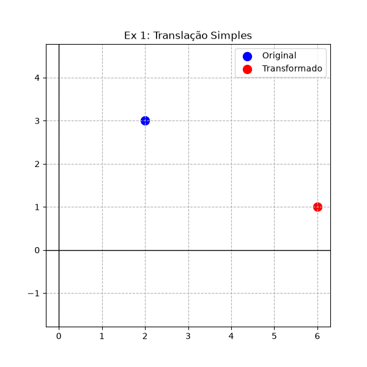
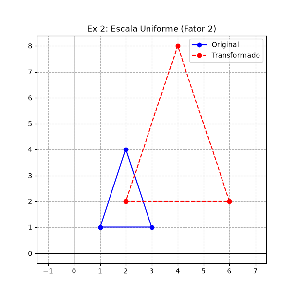
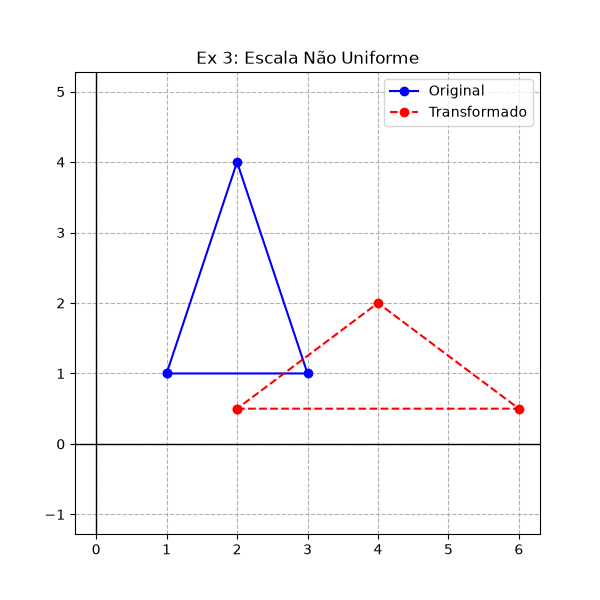
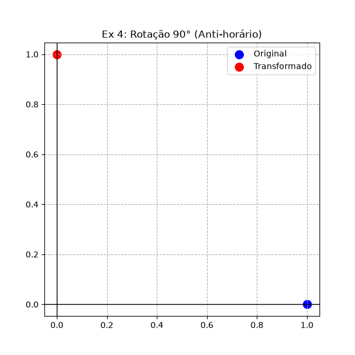
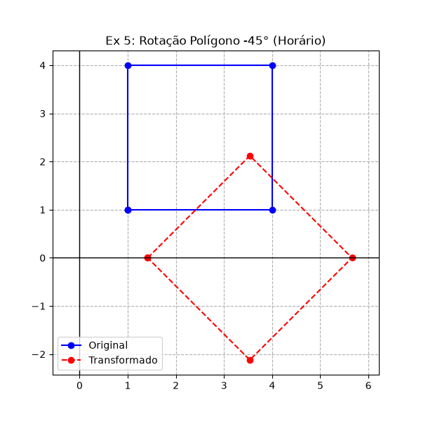
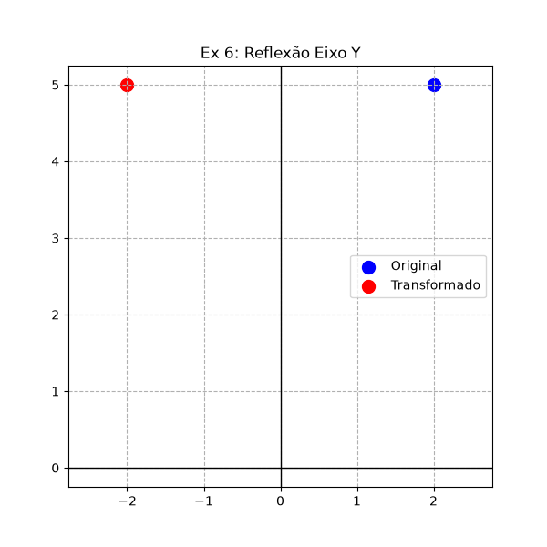
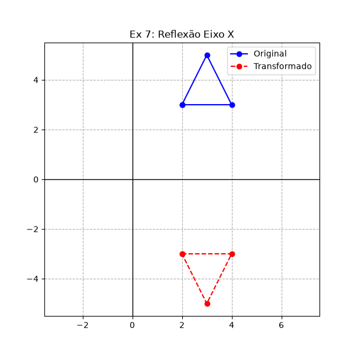
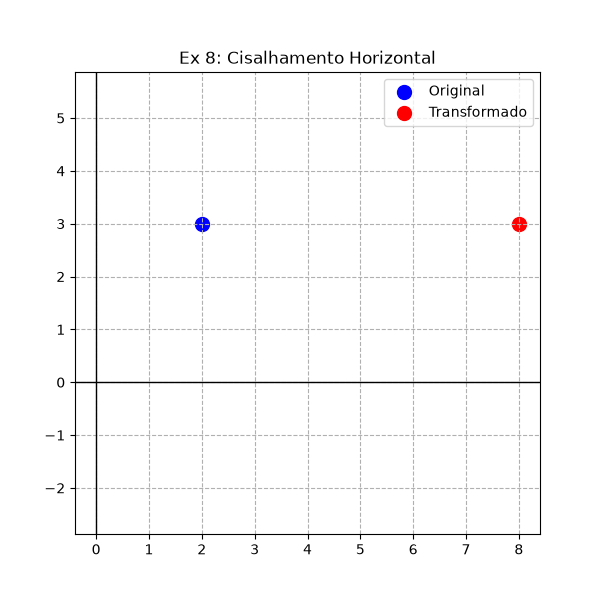
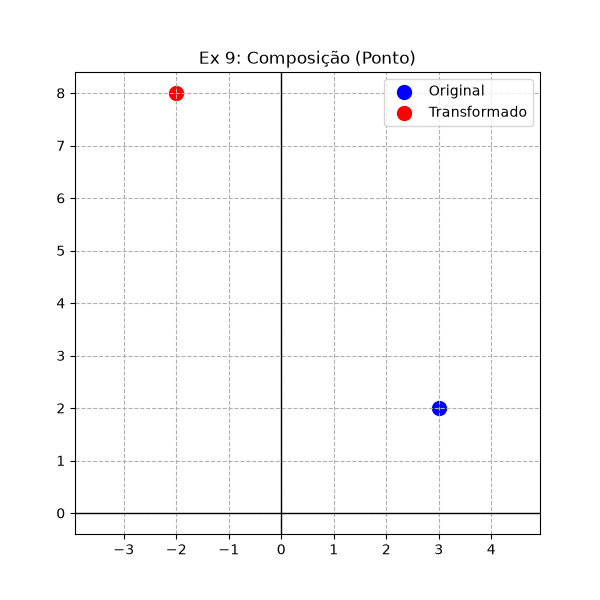
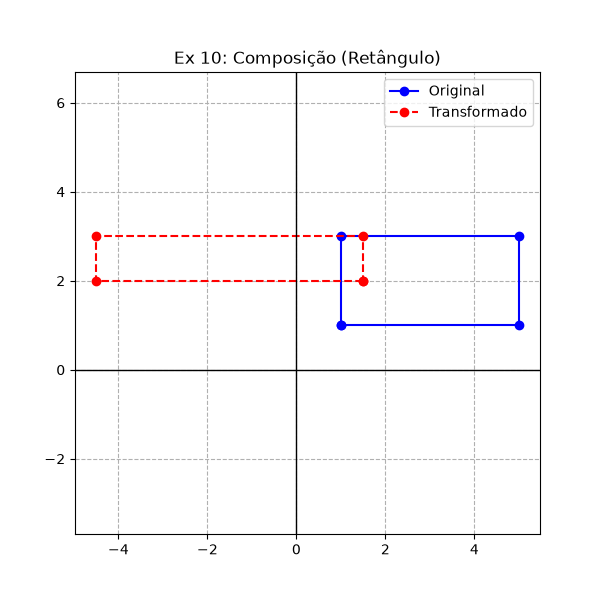

1) 
As novas coordenadas do ponto P são (6,1).
Ambas as coordenadas foram alteradas: a coordenada X foi do 2 para o 6 e a coordenada Y foi do 3 para o 1.

2) 
As novas coordenadas são A'(2,2), B'(6,2) e C'(4,8). O tamanho do triângulo quadruplica porque as arestas dobram de tamanho em todas as direções.

3)
As novas coordenadas são A'(2, 0.5), B'(6, 0.5) e C'(4, 2).

4) 
A nova posição do ponto depois de girar 90 graus no sentido anti-horário é P'(0,1).

5)
Rotacionar 45 graus no sentido horário exige aplicar a matemática para um ângulo negativo. As coordenadas aproximadas são arredondadas para 2 casas decimais e ficam: 
A'(1.41, 0), B'(3.54, 2.12), C'(5.66, 0) e D'(3.54, -2.12).

6)
Refletindo em relação ao eixo Y, o sinal do X é invertido. A nova posição é P'(-2, 5).

7)
Refletindo em relação ao eixo X, o sinal do Y é invertido. As novas coordenadas ficam A'(2, -3), B'(4, -3) e C'(3, -5).

8)
O cisalhamento horizontal desloca o eixo X baseado no Y. A fórmula altera o X para 2 + (2 * 3). A nova posição é P'(8, 3).

9)
A posição final é P'(-2, 8). (A ordem exata da mudança: a translação leva para (4, 1), a rotação leva para (-1, 4), e a escala finaliza em (-2, 8)).

10)
As coordenadas finais após os três passos consecutivos são A'(1.5, 2), B'(-4.5, 2), C'(-4.5, 3) e D'(1.5, 3).

